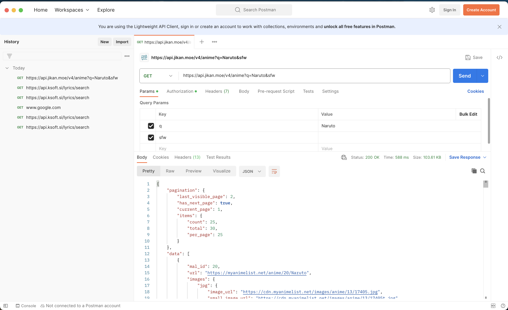

# CSC207Lab3

# Problem Domain
We decide to design a anime tracking app. The application is to build a social network for anime lovers.
This application aims to help user leave a record and comments for the anime he/she had seen.
User can also see the rate of particular anime from the people who have seen before. Users can even share his/her favourite anime with other suers. 

# high-level description
1. User can have a record of the anime he/she have seen.
2. The program is able to display detail (title, description, cast) for a specific anime that user queries
3. User can leave comments for the anime
4. User can rate for particular anime'
5. User is able to generate his favourite anime in a list and download it as a csv file to share with other people

# Link to the API Documentation
The Link to jikan.moe API can be found at following link:

https://docs.api.jikan.moe

#  screenshot of using a tool to try out the API



# example output of running your Java code 
The Java code can be found at `ApiTesting/src/main/java/AnimeApiexample.java`
It uses OkHttp to call `jikan.moe` API to search for an anime called 'naruto', here is the Java Code Output

```
Using OkHTTP to call URL https://api.jikan.moe/v4/anime?q=Naruto&sfw
The title of the First Anime in the request is Naruto
The Japanese title of the First Anime in the request is ナルト
```

# list of any technical problems blocking progress

1. The response of  `getAnimeSearch` is pagniated, which means we call not get all anime information we need in a single request. Subsequent requests are needed to get all information.
2. The `Jikan.moe` API has rate limit, which means the API request will fail if we call API too frequently. The current rate limit is 3 requests per second, which is likely not enough if we choose to use this API in our project for multiple users 